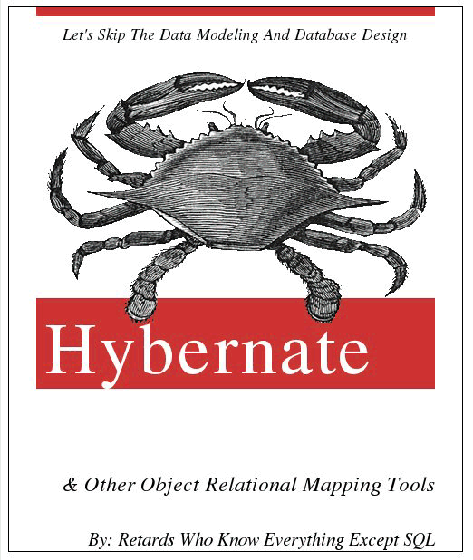

<!SLIDE bullets incremental transition=scrollRight>

# History

* Impetus

* We need some means of storing objects for use later. We want 'Persistence.'
* "So what is persistence?  Persistence simply means that we would like our application's data to outlive the applications process."

<!SLIDE bullets incremental transition=scrollRight>
* Faults

* 'Object-relational impedance mismatch'

* Basically, objects don't store well

* Or, relational databases don't store objects well

<!SLIDE bullets incremental transition=scrollRight>
* Arguments

* Use an ORM - it's what everyone does.

* Don't, ORMs are bad. 

<!SLIDE subsection>

# Validity of ORMs

<!SLIDE>

<!SLIDE bullets small>
* Suffice it to say, people can't agree. Go figure.
